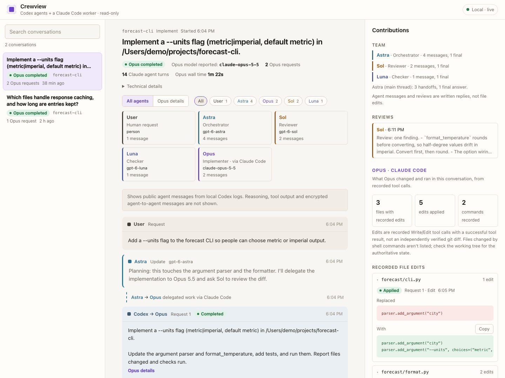

# Crewview

**Give your agents a crew. See what each one contributed.**

Crewview connects Codex desktop to Claude Code and gives you a local dashboard for the conversation: your requests, orchestration updates, worker replies, review findings, handoffs, and recorded file edits.

The starting workflow is **Astra orchestrates → Opus implements → Sol reviews → Opus fixes → Astra verifies**. You can configure those roles. Luna is the suggested helper for small checks.

Built for **macOS, Codex desktop, and Claude Code**. Python standard library only; no hosted service or separate Crewview account.



*Synthetic demo; no real conversation data.*

## Give this repository to your agent

Paste this into a local Codex task:

> Set up Crewview from https://github.com/GrantWasil/crewview. Read its AGENTS.md and docs/SETUP.md. Check the prerequisites, preserve my existing Codex settings, install the delegation bridge and dashboard, and verify the installation. Use my existing Claude Code subscription login; never extract credentials or substitute API billing. Ask me only for missing preferences, an interactive login, or permissions your tools actually require. Do not run a live model test unless I approve the model usage.

[Agent setup instructions](docs/SETUP.md) cover checks, model configuration, installation, verification, and troubleshooting.

## What you can see

- **All agents:** public messages from the linked Codex task and its explicitly connected task agents, combined with Claude bridge requests and replies.
- **Agent filters:** focus on the orchestrator, worker, reviewer, or helper.
- **Reviews:** jump directly to the reviewer's readable replies.
- **Worker details:** recorded tool activity, command results, new file content, and before/after text for replacement edits.
- **Live updates:** follow work without losing your scroll position or expanded details.

Crewview reads public messages. It does not reveal private reasoning. Some agent-to-agent payloads are encrypted in local Codex logs; these appear as handoff markers. A recorded successful edit is evidence of a tool result, not an independently verified Git diff. Shell-made file changes are not enumerated.

## Quick start

Prerequisites: macOS, **Python 3.11+**, Codex desktop with a usable Codex CLI, and Claude Code with an eligible Claude subscription login. Claude access and model availability depend on your account and organization policy.

```sh
git clone https://github.com/GrantWasil/crewview.git
cd crewview
python3 install.py --check
python3 install.py --dry-run
python3 install.py
```

Open a **fresh Codex task** after installation so it can discover the `crewview` MCP server. Start the dashboard:

```sh
~/.local/share/crewview/launch-dashboard.command
```

It opens at **http://127.0.0.1:8767/**. Leave its terminal running; Ctrl+C stops the dashboard. Bridge jobs run separately.

Example task:

> Use Crewview. Coordinate this task, delegate implementation to the configured Claude worker, and ask the configured reviewer to review it. Include this Codex task's exact thread ID when starting the bridge conversation so the dashboard can show the whole crew. Send review findings back to the same worker conversation, then verify the result.

## Configure your crew

Copy `crewview.example.json` to a local file and edit its `models` entries. Pass that file with `python3 install.py --config /absolute/path/to/crewview.json`.

The Claude worker setting controls the model requested by Claude Code. Orchestrator, reviewer, and helper settings supply workflow instructions; they do **not** replace Codex's model picker or grant access to models your account lacks. Explicitly select the orchestrator in Codex, and use native Codex delegation for review/helper work.

Worker model changes apply to new conversations after reloading the bridge; existing conversations keep their original model. See [model and workflow configuration](docs/WORKFLOW.md).

## Try the dashboard without model usage

```sh
python3 demo.py --output /tmp/crewview-demo
```

Follow the command it prints to launch synthetic conversations. Choose a fresh output directory. No login or model calls are required for the demo.

For an installation that only runs the viewer:

```sh
python3 install.py --dashboard-only
```

## Privacy and scope

The dashboard runs on loopback and is read-only. Local history includes prompts, public replies, and activity excerpts; keep it private. Do not expose the port through a public tunnel or upload your state folder. Loopback protection is not per-user authentication.

The bridge sends delegated prompts and permitted project context to Claude through Claude Code. Codex uses your configured OpenAI account. Crewview does not turn one subscription into access to another provider, extract tokens, or fall back to API billing.

See [privacy and permissions](docs/PRIVACY.md), [troubleshooting](docs/TROUBLESHOOTING.md), and [uninstalling](docs/SETUP.md#uninstall).

## Development

```sh
python3 -m unittest discover -s tests -v
python3 scripts/release-check.py
```

Tests use synthetic state and fake CLIs. The separate `smoke_test.py` performs real Claude work and consumes model usage; it is opt-in. Codex's local history format can change, so missing or unrecognized records are reported as incomplete coverage.

## License

[MIT](LICENSE). Independent community project; not an official OpenAI or Anthropic product.
